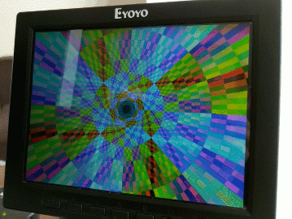

# m4vga-rs

[](https://travis-ci.org/cbiffle/m4vga-rs)

This crate provides 800x600 60fps graphics on the STM32F407 microcontroller. The
observant reader will note that the STM32F407 has no video hardware, or enough
RAM to hold an 800x600 color image. So how does `m4vga` get high-res color video
out of it?

*Magic.*



This is a rewrite of my C++ library [`m4vgalib`][11], plus ports of my
[collection of `m4vgalib` demos][1]. It is still a work in progress. (If you're
curious, see [my notes on the port][rust-port].)

(As of quite recently, several of the demos also compile for *another* platform
without video hardware: WebAssembly.)

## Why this is interesting

Mostly because it's really hard. I've got four CPU cycles *per pixel* to work
with, and any variation in timing will corrupt the display.

## The Demos

The demos all live in [m4demos/src/bin][3]. As of this writing, they are:

- [`conway`][conway]: full-screen [Conway's Game of Life][4] at 60fps -- that's
  28.8 million cell updates per second, for a budget of 5 cycles per update
  (not counting video generation).

- [`hires_text`][hires_text]: 80x37 text mode. Each character has adjustable
  foreground and background colors. This is boring to watch but technically
  interesting.

- [`horiz_tp`][horiz_tp]: generates a display calibration pattern of vertical
  stripes. This also demonstrates how to write a simple `m4vga`-based demo in
  40 lines of code.

- [`poly3`][poly3]: a tumbling dodecahedron made of solid polygons, with basic
  lighting.

- [`rook`][rook]: high-resolution 3D wireframe model with thousands of polygons,
  plus scrolling text. (The model is from my [chess set][chess-set]).

- [`rotozoom`][rotozoom]: old-school texture transform effect providing rotation
  and scaling. This is chunky (400x300) to save RAM...which is still too much
  data to double-buffer. This uses a trick to prevent tearing.

- [`tunnel`][tunnel]: demoscene "tunnel zoomer" effect drawing shaded textured
  graphics at 60fps. (This one is also 400x300, but it's hard to notice at
  speed.)

- [`xor_pattern`][xor_pattern]: fullscreen procedural texture with smooth
  scrolling.  Demonstrates how to add a custom assembly language raster
  function.

## Building it

You will need an STM32F407-based board to run this on; I use the
STM32F4-Discovery because it's *really cheap.* Hook it up to a VGA connector
according to [my instructions for C++][7].

I recommend following the setup chapters from the [Rust Embedded][6] book. In
particular, you need to have [Rust][2] and you need to make Rust aware of the
cross compilation target we're using here:

```shell
$ rustup target add thumbv7em-none-eabihf
```

You will also need a GNU ARM toolchain to compile the assembly language
routines. On Arch:

```shell
$ sudo pacman -S arm-none-eabi-{gcc,newlib}
```

On Ubuntu, the system ships an *ancient* version of GCC, but since we're only
assembling this is okay:

```shell
$ sudo apt-get install gcc-arm-none-eabi
```

Now you should be able to compile everything by entering:

```shell
$ cargo build --release
```

This will deposit several demo binaries in
`target/thumbv7em-none-eabihf/release/`.

And if you start `openocd` (tested with version 0.10) in this directory, it will
pick up the `openocd.cfg` file automagically, and (from a separate terminal) you
can flash one of the demos by typing:

```shell
$ cargo run --release --bin horiz_tp
```

(All of this is tested only on Linux.)

[1]: https://github.com/cbiffle/m4vgalib-demos
[2]: https://rust-lang.org
[3]: m4demos/src/bin
[4]: https://en.wikipedia.org/wiki/Conway%27s_Game_of_Life
[6]: https://rust-embedded.github.io/book
[7]: https://github.com/cbiffle/m4vgalib-demos/blob/master/README.mkdn#connections
[11]: https://github.com/cbiffle/m4vgalib

[conway]: m4demos/src/bin/conway
[hires_text]: m4demos/src/bin/hires_text.rs
[horiz_tp]: m4demos/src/bin/horiz_tp.rs
[poly3]: m4demos/src/bin/poly3/
[rook]: m4demos/src/bin/rook/
[rotozoom]: m4demos/src/bin/rotozoom.rs
[tunnel]: m4demos/src/bin/tunnel.rs
[xor_pattern]: m4demos/src/bin/xor_pattern

[chess-set]: http://cliffle.com/project/chess-set-i/
[rust-port]: doc/rust-port.md
